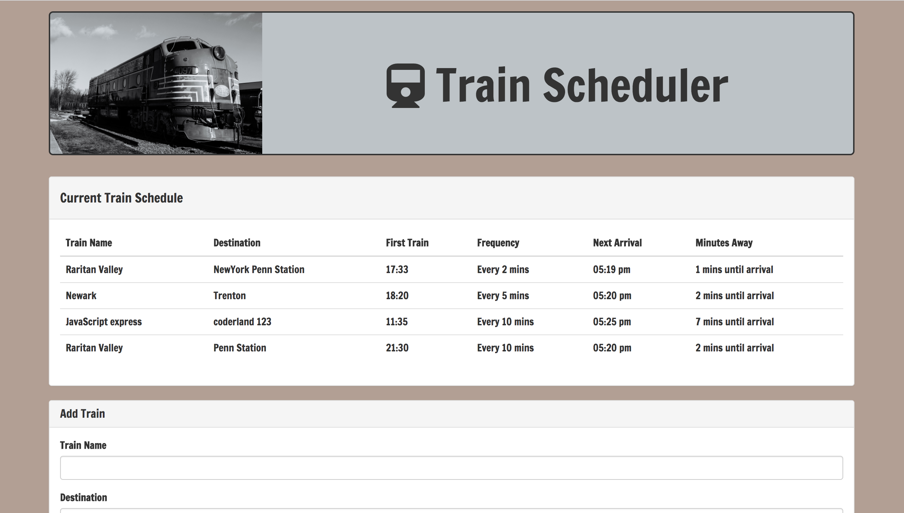
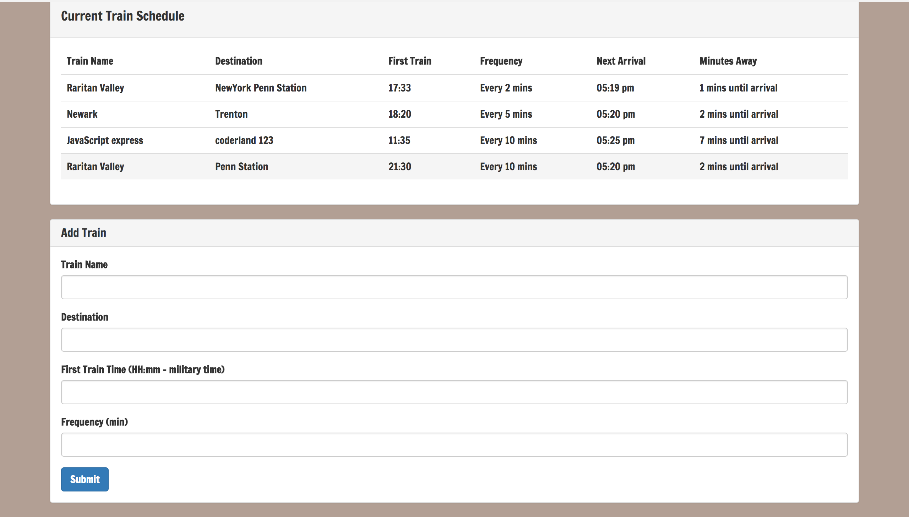

# Train Scheduler

### Front End Developer

* Train Scheduler Is a front end app that incorporates Firebase to host arrival and
departure data. The app will retrieve and manipulate this information with Moment.js. It will provide up-to-date information about various trains, namely their arrival times and how many minutes remain until they arrive at their station.

## Developed using : jQuery, Firebase, Moment.js, CSS, HTML, And Bootstrap framework.

	

## Link to the App: [Live App](https://malnasseri.github.io/Train-Scheduler-Firebase)

## Below Are some screen shots:

